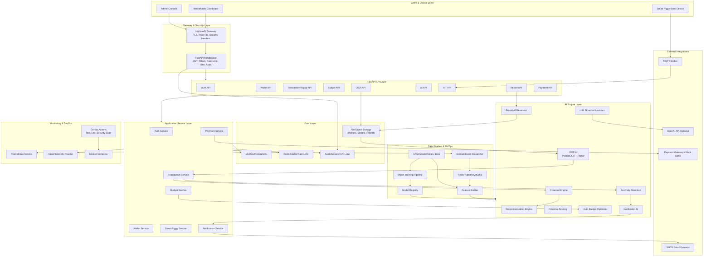
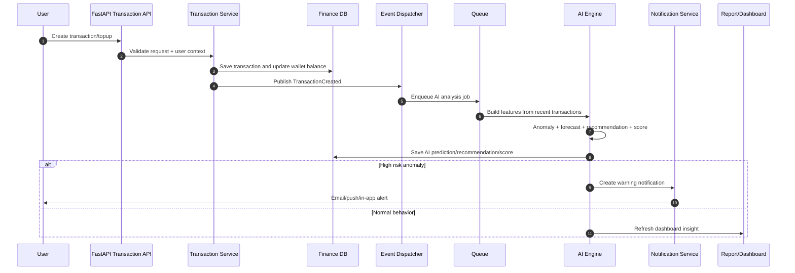
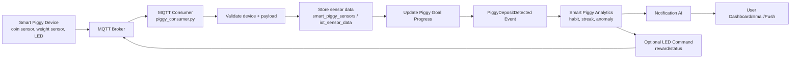

# AI Finance Management & Smart Piggy Bank - Architecture Audit & Redesign

## 1. Executive Summary

Source code hiện tại là một backend FastAPI cho nền tảng tài chính cá nhân, có định hướng enterprise khá rõ: authentication, wallet, topup, notification worker, middleware bảo mật, logging, i18n, SQLAlchemy models cho finance, ledger, payment, IoT, OCR, AI và Smart Piggy Bank.

Tuy nhiên, khi đối chiếu theo source code thực tế, hệ thống mới hoàn thiện một phần nhỏ của kiến trúc:

- API đang expose thực tế: auth register/login/verification, wallet CRUD, wallet topup, một endpoint report dưới `auth/report.py`.
- Database models rất đầy đủ nhưng nhiều domain chưa có route/service/repository tương ứng.
- AI hiện có chỉ có anomaly detection bằng Z-score trong `app/services/ai/predict_service.py`; chưa thấy được gọi từ luồng giao dịch/topup.
- OCR, IoT, Payment, Budget, Analytics, Ledger, Report, Recommendation, LLM Assistant chủ yếu mới là folder/model placeholder hoặc chưa đủ dữ liệu để kết luận đã hoạt động.
- Queue/event architecture có dependency Kafka, Celery, gmqtt, Redis nhưng code thực tế mới dùng Redis rate limit và worker gửi email quét DB bằng APScheduler/loop.
- Có technical debt đáng kể: route/service mismatch ở wallet topup, nhiều file rỗng, CI rỗng, Dockerfile sai dạng CMD, docker-compose chỉ chạy web, migration tự động tạo revision lúc startup gây rủi ro.

Kết luận: kiến trúc mục tiêu nên được thiết kế lại thành monolith FastAPI modular, thêm AI Engine Layer riêng nhưng triển khai theo lộ trình. Không nên đưa quá nhiều microservice ngay từ đầu vì không phù hợp độ phức tạp của đồ án Python.

## 2. Đánh Giá Kiến Trúc Hiện Tại Theo Source Code

### 2.1 Layers

| Layer | Bằng chứng source code | Chức năng | Mức cần thiết | Độ phức tạp | Phù hợp đồ án |
|---|---|---|---|---|---|
| API Layer | `app/api/router.py`, `app/api/v1/*` | Auto-discover router FastAPI | Cao | Trung bình | Phù hợp |
| Middleware Layer | `app/core/middleware/middleware.py` | correlation, clock, fingerprint, i18n, body buffer, security headers, Redis rate limit, DB session, JWT auth, RBAC, structured logging | Cao | Cao | Hơi nặng nhưng có giá trị demo |
| Service Layer | `app/services/*` | Business logic cho auth, wallet, topup, notification, AI | Cao | Trung bình | Phù hợp |
| Repository Layer | `app/repositories/*` | Data access, một phần raw SQL/mapping | Cao | Trung bình | Phù hợp nhưng chưa nhất quán |
| Model Layer | `app/models/*` | ORM schema cho finance, AI, OCR, IoT, payment, notification, ledger | Cao | Cao | Quá rộng so với phần đã implement |
| Schema Layer | `app/schemas/*` | Pydantic request/response | Cao | Thấp | Phù hợp |
| Config Layer | `app/core/config/settings.py` | env, DB, Redis, SMTP, JWT | Cao | Thấp | Phù hợp |
| Security Layer | `app/core/security/*` | JWT, hashing, permissions, csrf, rate limit, encryption | Cao | Trung bình | Phù hợp nhưng một số phần chưa được wire rõ |
| Observability Layer | `app/core/logging`, `app/core/observability`, middleware logging | API log, security log, request flow log | Trung bình | Cao | Nên đơn giản hóa |
| Worker Layer | `app/jobs/notification_worker.py`, `run_worker.py` | Quét notification pending và gửi email SMTP | Trung bình | Trung bình | Phù hợp MVP |
| Event Layer | `app/core/events/*` | Có event classes/dispatcher | Trung bình | Thấp | Chưa đủ dữ liệu để kết luận đã dùng thực tế |

### 2.2 Service, Middleware, API Gateway, Database, Cache, Queue, Worker, IoT, AI, OCR, Payment, Notification, Monitoring, DevOps

| Thành phần | Hiện trạng source code | Đánh giá |
|---|---|---|
| API Gateway | `gateway/nginx/nginx.conf`, `routes.conf`, rate limit config | Có cấu hình Nginx nhưng docker-compose chưa chạy gateway. Cần thiết cho production demo, chưa cần cho MVP. |
| FastAPI App | `app/main.py` | Có app, lifespan, middleware, exception handler, router auto-discovery. Cần thiết. |
| Database | SQLAlchemy MySQL qua `DATABASE_URL`, `SessionLocal`, rất nhiều ORM models | Cốt lõi. Schema rộng, nhưng nhiều bảng chưa có flow nghiệp vụ. |
| Migration | Alembic trong startup: upgrade, revision autogenerate, upgrade | Không nên tạo migration tự động lúc runtime. Rủi ro cao cho production và đồ án. |
| Cache | Redis dùng cho rate limit | Có dùng thực tế. Chưa dùng cache nghiệp vụ/session. |
| Queue | requirements có Kafka, Celery, AMQP; folder `app/kafka`, `consumers` | Chủ yếu skeleton, chưa đủ dữ liệu để kết luận hoạt động. Worker hiện không dùng Kafka/Celery. |
| Worker | Notification worker quét DB và gửi SMTP | Có logic thực tế, nhưng hard-code email trong worker là technical debt. |
| IoT | models `iot_*`, `smart_piggy_*`, MQTT package, `piggy_consumer.py` rỗng | Chủ yếu data model/placeholder. Chưa có MQTT flow thực tế. |
| AI | `PredictService.detect_transaction_anomaly` | Có Z-score anomaly detection nhưng chưa thấy được gọi. Chưa có prediction/recommendation/LLM/OCR AI. |
| OCR | models `ocr_results`, `ocr_extracted_items`, package service/repository rỗng | Placeholder. Chưa thấy PaddleOCR/Tesseract/API upload receipt. |
| Payment | models payment method/transaction/webhook/refund/reconciliation | Data model có, API/service chưa có. Topup dùng mock bank account, chưa tích hợp payment gateway. |
| Notification | notification service, repository, worker, templates, logs | Có triển khai tương đối thực tế cho email verification/wallet notification. |
| Monitoring | middleware ghi request flow/API/security/system log; observability files rỗng | Logging nhiều, nhưng metrics/tracing rỗng. Chưa có Prometheus/OpenTelemetry thực tế. |
| DevOps | Dockerfile, docker-compose, GitHub workflows | Có file nhưng compose chỉ có web, workflow rỗng, Dockerfile CMD sai cú pháp exec-form. |

## 3. Những Gì Đã Hoàn Thành

- FastAPI application bootstrap với auto-discover routers.
- Middleware pipeline: trace ID, DB session, JWT decode, RBAC cơ bản, security headers, rate limiting bằng Redis, structured logging.
- Auth flow: register, login, activate link, verify OTP ở mức service/route.
- Wallet CRUD: create, detail, list, update, soft delete.
- Wallet topup service với validations về hạn mức, duplicate, row locking, mock bank account, cập nhật balance, tạo transaction.
- Notification queue table + worker SMTP gửi email.
- i18n JSON sync và translator.
- SQLAlchemy models cho nhiều domain: finance, wallet, auth, notification, ledger, payment, IoT, Smart Piggy, OCR, AI, audit/logging.
- Một AI anomaly detector đơn giản bằng Z-score.

## 4. Những Gì Còn Thiếu Hoặc Chưa Đủ Dữ Liệu Kết Luận

- Chưa có API thực tế cho `ai`, `ocr`, `iot`, `payment`, `budgets`, `ledger`, `analytics`, `reports`, `smart_piggy`, `transfers`, `users` vì các package này chỉ có `__init__.py` hoặc thiếu router.
- Chưa thấy Smart Piggy Bank device ingestion qua MQTT hoạt động.
- Chưa thấy OCR pipeline đọc hóa đơn.
- Chưa thấy recommendation engine, forecast engine, financial score service, budget optimizer.
- Chưa thấy LLM assistant hoặc OpenAI API.
- Chưa thấy queue Kafka/Celery hoạt động thực tế.
- Chưa thấy model training pipeline/model registry thực tế.
- Chưa có tests trong `tests`.
- GitHub workflow files rỗng.
- Không đủ dữ liệu để kết luận frontend/dashboard đã tồn tại.

## 5. Đánh Giá AI Hiện Có

| AI Capability | Hiện trạng | Kết luận |
|---|---|---|
| Anomaly Detection | Có `PredictService.detect_transaction_anomaly`, dùng NumPy Z-score trên 30 giao dịch gần nhất | Có logic thật nhưng đơn giản, chưa thấy được gọi trong transaction/topup |
| Prediction | Có model `ai_predictions`, file `model.pkl`, nhưng `train_model.py` rỗng | Placeholder |
| Recommendation | Có model `ai_recommendations` | Placeholder |
| OCR | Có models OCR | Placeholder |
| NLP/LLM | Không thấy OpenAI/langchain/transformers hoặc service assistant | Chưa có |
| Financial Score | Có model `ai_financial_scores` | Placeholder |
| Time Series Forecasting | Không thấy implementation | Chưa có |
| Classification | Không thấy implementation | Chưa có |
| Clustering | Không thấy implementation | Chưa có |
| Receipt Analysis | Không thấy OCR parser/service | Chưa có |
| AI Notification | Notification hiện rule-based/worker SMTP | Chưa có AI |
| Report Generator | Không thấy AI report service | Chưa có |

## 6. AI Cần Bổ Sung

| AI Module | Mục tiêu | Công nghệ Python phù hợp | Ưu tiên |
|---|---|---|---|
| AI Financial Assistant | Chat hỏi đáp tài chính cá nhân, giải thích chi tiêu, gợi ý ngân sách | OpenAI API hoặc local LLM nhẹ; RAG trên dữ liệu giao dịch đã tổng hợp | Cao |
| Recommendation Engine | Gợi ý giảm chi tiêu, tăng tiết kiệm, phân bổ ngân sách | Rule-based trước, sau đó scikit-learn ranking | Cao |
| Spending Prediction | Dự báo chi tiêu tuần/tháng | pandas, scikit-learn, Prophet/statsmodels hoặc PyTorch LSTM nếu cần | Cao |
| Budget Optimizer | Đề xuất budget theo category và mục tiêu tiết kiệm | Linear programming đơn giản hoặc heuristic | Cao |
| Financial Score | Chấm điểm sức khỏe tài chính | Rule-based scoring + explainability | Cao |
| Receipt Analysis | Upload hóa đơn, OCR, extract merchant/items/total/category | PaddleOCR, regex/parser, optional LLM cleanup | Trung bình |
| Smart Piggy Analytics | Phân tích hành vi bỏ tiền, tiến độ mục tiêu, streak, coin sensor | MQTT + feature aggregation + rule/ML | Trung bình |
| Anomaly Detection v2 | Bất thường giao dịch, device, login, topup | IsolationForest/LocalOutlierFactor + Z-score fallback | Cao |
| AI Notification Engine | Chọn thời điểm/nội dung thông báo thông minh | rule-based + bandit đơn giản | Trung bình |
| AI Report Generator | Báo cáo tuần/tháng bằng Markdown/PDF | pandas + Jinja2 + LLM summary | Trung bình |
| Model Training Pipeline | Huấn luyện định kỳ, lưu metrics | Celery/APScheduler + MLflow hoặc table `ai_model_logs` | Trung bình |
| Model Registry | Quản lý model version, status, path, metrics | DB table + file storage, hoặc MLflow nếu muốn nâng cao | Trung bình |

## 7. Automation Cần Bổ Sung

- Daily spending analysis: tổng hợp giao dịch theo category, wallet, merchant.
- Weekly/monthly spending forecast: dự báo chi tiêu còn lại trong kỳ.
- Auto budget optimization: điều chỉnh ngân sách theo lịch sử, thu nhập, mục tiêu.
- Anomaly event automation: khi tạo transaction/topup thì emit event, AI kiểm tra, ghi risk và gửi notification.
- Receipt automation: sau upload hóa đơn, worker OCR parse, tạo transaction draft.
- Smart Piggy sync: MQTT event từ device, lưu sensor/coin log, cập nhật goal progress.
- Smart Piggy anomaly: phát hiện device offline, sensor payload bất thường, coin count bất thường.
- Report automation: tạo báo cáo tuần/tháng, lưu report, gửi email/push.
- Model retraining: chạy hàng tuần/tháng hoặc khi đủ dữ liệu mới; lưu model log/version.
- Dashboard refresh: materialized aggregate hoặc cache Redis theo lịch.

## 8. Kiến Trúc Đề Xuất

### 8.1 Nguyên tắc thiết kế lại

- Giữ FastAPI modular monolith cho đồ án tốt nghiệp, tránh microservice hóa quá sớm.
- Tách AI Engine Layer thành các service Python rõ ràng, gọi sync cho tác vụ nhẹ và async qua queue cho tác vụ nặng.
- Ưu tiên rule-based + scikit-learn trước; LLM chỉ dùng cho assistant/report/explanation, không quyết định giao dịch tiền trực tiếp.
- Dùng event-driven nhẹ: domain event -> Redis/RabbitMQ/Celery hoặc Kafka nếu muốn enterprise hơn.
- IoT dùng MQTT broker riêng; backend subscribe MQTT và chuyển payload thành domain event.
- OCR chạy async worker để tránh block API.
- Monitoring tối thiểu: structured logs, request metrics, worker metrics, model metrics.

### 8.2 Target Layers

| Layer | Thành phần |
|---|---|
| Client Layer | Web/mobile dashboard, IoT device Smart Piggy, admin console |
| Gateway Layer | Nginx/API Gateway, TLS, rate limit, request tracing |
| API Layer | FastAPI routers: auth, wallets, transactions, budgets, OCR, AI, IoT, reports, payment |
| Application Service Layer | AuthService, WalletService, TransactionService, BudgetService, SmartPiggyService, PaymentService |
| AI Engine Layer | Recommendation Engine, Forecast Engine, OCR AI, LLM Assistant, Financial Scoring, Auto Budget, Anomaly Detection, Notification AI, Report AI |
| Data Pipeline Layer | Event consumer, feature builder, model trainer, model registry, scheduled jobs |
| Integration Layer | SMTP, payment gateway/mock bank, MQTT broker, optional OpenAI API |
| Infrastructure Layer | MySQL/PostgreSQL, Redis, RabbitMQ/Kafka, object/file storage |
| Observability/Security | JWT/RBAC, audit logs, metrics, tracing, model logs |
| DevOps | Docker Compose, Alembic migrations, CI test/lint/security scan |

## 9. Source Code Audit

### 9.1 Module Đã Hoàn Thành Tương Đối

- `app/main.py`: app bootstrap, middleware, exception handling.
- `app/api/router.py`: auto discovery router.
- `app/api/v1/auth/*`: register/login/verification endpoints.
- `app/api/v1/wallets/wallet.py`: wallet CRUD endpoints.
- `app/api/v1/transactions/wallet_topup.py`: topup endpoint, nhưng có lỗi signature khi gọi service.
- `app/services/auth/*`: auth processors, token, OTP, verification.
- `app/services/wallet/wallet_service.py`: wallet business logic.
- `app/services/finance/wallet_topup_service.py`: topup business logic.
- `app/services/notification` + `app/jobs/notification_worker.py`: notification queue/email worker.
- `app/core/middleware/middleware.py`: middleware pipeline.
- `app/models/*`: ORM models rất rộng.

### 9.2 Module Chưa Hoàn Thành

- `app/api/v1/ai`, `analytics`, `budgets`, `iot`, `ledger`, `notifications`, `ocr`, `payment`, `reports`, `smart_piggy`, `transfers`, `users`: chưa có route implementation.
- `app/services/ai/train_model.py`, `app/services/ai/anomaly_detection.py`: rỗng.
- `app/services/ocr`, `app/repositories/ocr`: chưa có implementation.
- `app/services/iot`, `app/repositories/iot`, `app/mqtt/consumers/piggy_consumer.py`: chưa có implementation thực tế.
- `app/kafka/*`, `consumers/*`, `producers/*`, `schedulers/*`, `tasks/*`: không đủ dữ liệu để kết luận hoạt động.
- `app/core/observability/metrics.py`, `tracing.py`: rỗng.
- `tests`: không có test file.
- `github/workflows/*`: rỗng.

### 9.3 Technical Debt Quan Trọng

- `wallet_topup_endpoint` truyền `user_agent` và `idempotency_key` vào `execute_topup`, nhưng service không nhận hai tham số này. Route có thể crash runtime.
- `Dockerfile` dùng `CMD ['uvicorn', ...]` dạng single quote, không phải exec-form JSON hợp lệ; nên dùng `CMD ["uvicorn", "app.main:app", "--host", "0.0.0.0", "--port", "8000"]`.
- `docker-compose.yml` chỉ chạy web, chưa có MySQL, Redis, worker, gateway, MQTT broker.
- Startup tự `alembic revision --autogenerate` trong `lifespan`; không nên tạo migration tự động mỗi lần chạy app.
- Nhiều comment/log bị lỗi encoding, gây khó đọc.
- Notification worker hard-code email `voduylebt99@gmail.com`.
- Có dependency enterprise như Kafka/Celery/gmqtt nhưng thiếu wiring, dễ tạo cảm giác over-engineering.
- Auto-discover routers có thể nuốt lỗi import bằng print, khiến route missing khó phát hiện.
- Mix raw SQL và ORM chưa nhất quán.
- API modules có nhiều folder rỗng, làm kiến trúc trông hoàn chỉnh hơn source thực tế.

### 9.4 Ưu Điểm

- Domain modeling rộng và có ý tưởng tốt cho finance + IoT + AI.
- Middleware có tư duy audit/security/logging rõ.
- Có i18n, JWT, RBAC, rate limit, SMTP notification.
- Wallet/topup có nhiều validation nghiệp vụ.
- Có nền tảng tốt để mở rộng thành đồ án AI finance.

### 9.5 Nhược Điểm

- Chưa có tests để chứng minh flow chạy ổn.
- AI chưa được tích hợp vào transaction flow.
- OCR/IoT/Payment/Recommendation/Forecast chủ yếu là placeholder.
- DevOps chưa chạy đầy đủ stack.
- Kiến trúc hiện tại dùng nhiều tên enterprise nhưng implementation chưa tương ứng.

## 10. Roadmap MVP -> Production Ready

| Phase | Công việc | Ưu tiên | Ước lượng |
|---|---|---:|---:|
| Phase 1 - Stabilize MVP | Sửa topup signature, sửa Dockerfile, tách migration khỏi startup, tạo docker-compose MySQL/Redis/web/worker, thêm smoke tests auth/wallet/topup | P0 | 1-2 tuần |
| Phase 2 - Finance Core | Hoàn thiện transaction CRUD, category, budget, transfer, report cơ bản; chuẩn hóa repository/service/schema | P0 | 2-3 tuần |
| Phase 3 - Smart Piggy IoT | MQTT broker, device registration, coin/sensor ingestion, goal progress, device logs, dashboard APIs | P1 | 2-3 tuần |
| Phase 4 - OCR Receipt | Upload receipt, PaddleOCR worker, parse merchant/items/total, tạo transaction draft | P1 | 2 tuần |
| Phase 5 - AI Foundation | Feature tables, anomaly detection integrated on transaction event, financial score rule-based, model logs | P1 | 2 tuần |
| Phase 6 - Forecast & Recommendation | Spending forecast, budget optimizer, recommendation engine, notification trigger | P1 | 2-3 tuần |
| Phase 7 - LLM Assistant & Report AI | AI assistant API, safe prompt with user financial summary, monthly Markdown/PDF report generator | P2 | 2 tuần |
| Phase 8 - Production Ready | CI, tests, Prometheus metrics, structured logging cleanup, security review, backup, deployment docs | P2 | 2-3 tuần |

## 11. Mermaid Enterprise Architecture

## 12. Mermaid AI Event Flow

## 13. Mermaid IoT Flow

## 14. PlantUML Enterprise Architecture

```plantuml
@startuml
skinparam componentStyle rectangle
skinparam packageStyle rectangle
title AI Finance Management & Smart Piggy Bank - Proposed Enterprise Architecture

actor User
node "Smart Piggy Bank Device" as Piggy

package "Gateway & Security" {
  component "Nginx API Gateway" as Nginx
  component "FastAPI Middleware\nJWT/RBAC/RateLimit/i18n/Audit" as MW
}

package "FastAPI API Layer" {
  component "Auth API" as AuthAPI
  component "Wallet API" as WalletAPI
  component "Transaction API" as TxAPI
  component "Budget API" as BudgetAPI
  component "OCR API" as OCRAPI
  component "AI API" as AIAPI
  component "IoT API" as IoTAPI
  component "Report API" as ReportAPI
  component "Payment API" as PaymentAPI
}

package "Application Services" {
  component "Auth Service" as AuthSvc
  component "Wallet Service" as WalletSvc
  component "Transaction Service" as TxSvc
  component "Budget Service" as BudgetSvc
  component "Smart Piggy Service" as PiggySvc
  component "Payment Service" as PaySvc
  component "Notification Service" as NotiSvc
}

package "AI Engine Layer" {
  component "Recommendation Engine" as Rec
  component "Forecast Engine" as Forecast
  component "OCR AI" as OCRAI
  component "LLM Assistant" as LLM
  component "Financial Scoring" as Score
  component "Auto Budget Optimizer" as AutoBudget
  component "Anomaly Detection" as Anomaly
  component "Notification AI" as NotiAI
  component "Report AI" as ReportAI
}

package "Data Pipeline & MLOps" {
  queue "Event Queue\nRedis/RabbitMQ/Kafka" as Queue
  component "Feature Builder" as Feature
  component "Training Pipeline" as Trainer
  database "Model Registry" as Registry
  component "Scheduler" as Scheduler
}

database "Finance DB\nMySQL/PostgreSQL" as DB
database "Redis Cache" as Redis
folder "File/Object Storage" as Storage
queue "MQTT Broker" as MQTT
cloud "SMTP Gateway" as SMTP
cloud "Payment Gateway / Mock Bank" as Payment
cloud "OpenAI API Optional" as OpenAI

User --> Nginx
Nginx --> MW
MW --> AuthAPI
MW --> WalletAPI
MW --> TxAPI
MW --> BudgetAPI
MW --> OCRAPI
MW --> AIAPI
MW --> IoTAPI
MW --> ReportAPI
MW --> PaymentAPI

AuthAPI --> AuthSvc
WalletAPI --> WalletSvc
TxAPI --> TxSvc
BudgetAPI --> BudgetSvc
IoTAPI --> PiggySvc
PaymentAPI --> PaySvc
OCRAPI --> OCRAI
ReportAPI --> ReportAI
AIAPI --> LLM

AuthSvc --> DB
WalletSvc --> DB
TxSvc --> DB
BudgetSvc --> DB
PiggySvc --> DB
PaySvc --> DB
NotiSvc --> SMTP
PaySvc --> Payment

TxSvc --> Queue
Piggy --> MQTT
MQTT --> PiggySvc
Queue --> Feature
Feature --> Anomaly
Feature --> Forecast
Feature --> Rec
Feature --> Score
Forecast --> AutoBudget
Anomaly --> NotiAI
Rec --> NotiAI
NotiAI --> NotiSvc
OCRAI --> Storage
ReportAI --> Storage
LLM --> OpenAI
Scheduler --> Trainer
Trainer --> Registry
Registry --> Forecast
Registry --> Anomaly
Registry --> Rec
Redis --> MW
@enduml
```

## 15. Kết Luận

Hệ thống hiện tại có nền móng backend tốt và schema domain rộng, nhưng chưa phải là một hệ thống AI Finance Management hoàn chỉnh. Để phù hợp đồ án tốt nghiệp Python, nên tập trung hoàn thiện một luồng end-to-end rõ ràng:

1. User tạo ví/giao dịch.
2. Hệ thống tự phân tích chi tiêu.
3. AI phát hiện bất thường, dự báo chi tiêu, gợi ý ngân sách.
4. Smart Piggy gửi dữ liệu qua MQTT và cập nhật mục tiêu tiết kiệm.
5. OCR hóa đơn tạo transaction draft.
6. LLM Assistant giải thích insight và tạo báo cáo.

Nếu triển khai theo roadmap trên, đồ án sẽ có đủ chiều sâu kỹ thuật: FastAPI, SQLAlchemy, Redis, worker, MQTT, OCR, scikit-learn, LLM, automation, monitoring và DevOps, nhưng vẫn nằm trong phạm vi có thể hoàn thành.
